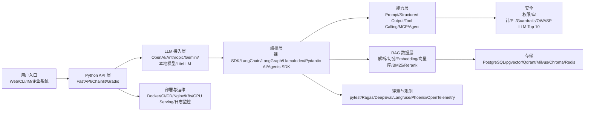
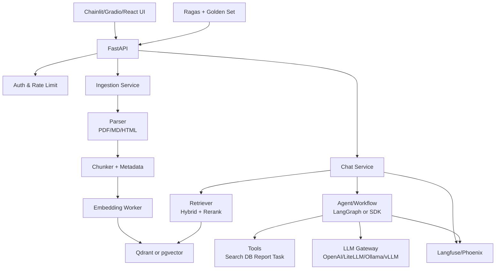

# 大模型应用开发（Python 端）学习路线与项目手册

调研日期：2026-06-18  
适用对象：想从 Python 后端/应用工程方向进入大模型应用开发的人  
核心目标：能独立做出一个可部署、可评测、可观测、可扩展的大模型应用，而不是只会调用一次 API。

## 0. 一句话结论

大模型应用开发的主线不是先训练大模型，而是先掌握：

1. Python 工程能力
2. LLM API 调用、流式输出、结构化输出、工具调用
3. RAG：文档解析、切分、Embedding、向量检索、重排、引用溯源
4. Agent：工具编排、状态管理、人工确认、多步骤任务
5. 评测与观测：离线测试集、RAG 指标、调用链追踪、成本与延迟监控
6. 安全与生产化：权限、提示词注入防护、输出校验、部署、缓存、限流、降级
7. 本地模型与微调：Ollama/vLLM/TGI、PEFT/LoRA/TRL，只在有明确需求时深入

建议学习顺序：先裸 SDK，再 RAG，再框架，再 Agent，再评测与部署。不要一开始就被框架绑架。

## 1. 当前技术栈地图



## 2. 必学知识清单

### 2.1 Python 工程基础

必须掌握：

- Python 3.12/3.13，优先 3.12 起步，兼容性更稳。
- 虚拟环境与依赖管理：`uv` 优先，其次 Poetry/pip-tools。
- 类型系统：`typing`、`Annotated`、`Protocol`、泛型、异步类型标注。
- Pydantic v2：请求/响应模型、配置、校验、JSON Schema、错误处理。
- 异步编程：`asyncio`、`httpx`、异步流、超时、重试、并发控制。
- 测试：`pytest`、fixture、mock、快照测试、集成测试。
- 代码质量：`ruff`、`mypy` 或 `pyright`、pre-commit。

为什么重要：大模型应用的问题往往不是“不会问模型”，而是接口不稳定、输出不可控、异常处理差、成本失控、数据流混乱。

### 2.2 后端与产品工程

推荐学习：

- FastAPI：REST API、SSE 流式响应、WebSocket、依赖注入、中间件。
- 数据库：PostgreSQL、SQLAlchemy/SQLModel、迁移工具 Alembic。
- 缓存与任务队列：Redis、RQ/Celery/Arq。
- 鉴权：JWT、OAuth2、API key、RBAC。
- 文件处理：PDF、Markdown、HTML、Office 文档、图片 OCR。
- Docker Compose：本地一键启动 API、数据库、向量库、观测服务。

### 2.3 LLM 基础概念

要理解到能做工程决策：

- Token、上下文窗口、输入/输出成本、延迟。
- 采样参数：temperature、top_p、max tokens、stop。
- Chat/Responses API、messages、system/developer/user 工程边界。
- 流式输出与增量渲染。
- 结构化输出：JSON Schema、Pydantic、严格 schema、失败重试。
- Function calling/tool calling：模型只生成调用意图，真正执行在应用侧。
- 多模态：文本、图片、音频、文档输入的基本接口。
- Embedding：语义向量、相似度、维度、归一化、召回。

截至 2026-06-18，OpenAI 官方文档把 Responses API 作为新项目推荐入口，并在最新模型指南中以 GPT-5.5 作为当前最新模型族重点说明。实际开发中应把模型名称、价格、上下文窗口、工具能力配置化，避免写死。

### 2.4 Prompt Engineering

必须会：

- 明确角色、目标、输入、约束、输出格式。
- 少写“玄学提示词”，多写可验证的输出契约。
- 使用 few-shot 示例，但不要无限堆示例。
- 对 RAG 提示词加入引用要求、未知问题处理、不得编造规则。
- 对 Agent 提示词加入工具边界、权限边界、人工确认点。
- 用评测集迭代 prompt，而不是靠手感。

推荐模板：

```text
你是一个{角色}。
任务：{目标}
输入：{输入字段说明}
可用上下文：{检索片段或工具结果}
约束：
- 只基于给定上下文回答。
- 不确定时说明缺失信息。
- 输出必须符合给定 JSON Schema。
输出：
{schema 或示例}
```

### 2.5 RAG 核心能力

RAG 是 Python 大模型应用开发最重要的主战场之一。

你需要掌握：

- 数据接入：PDF、Word、Markdown、网页、数据库、API、对象存储。
- 文档解析：PyMuPDF、unstructured、Docling、MarkItDown、OCR。
- 清洗：去页眉页脚、去广告、表格处理、代码块保留、元数据抽取。
- 切分：固定窗口、递归切分、语义切分、标题层级切分、滑动窗口。
- Embedding：模型选择、批量生成、缓存、版本管理。
- 向量库：Chroma、Qdrant、Milvus、pgvector、Weaviate。
- 检索：向量召回、BM25、混合检索、元数据过滤、多路召回。
- 重排：cross-encoder reranker、BGE reranker、Cohere/Jina/开源 reranker。
- 生成：引用片段、答案置信度、拒答、上下文压缩。
- 评测：context precision、context recall、faithfulness、answer relevancy。

一个合格的 RAG 系统至少要能回答：

- 命中了哪些文档？
- 每个答案依据哪几个片段？
- 检索不到时如何拒答？
- 文档更新后如何重建索引？
- Embedding 模型升级后如何迁移？
- 召回失败是切分问题、Embedding 问题、查询改写问题还是重排问题？

### 2.6 Agent 与工具调用

Agent 不是“让模型自己想办法”，而是一个受控的工具编排系统。

必须掌握：

- Tool schema：函数名、参数、描述、返回值。
- Tool execution loop：模型请求工具、应用执行工具、结果回传模型。
- 状态管理：短期上下文、长期记忆、任务状态、checkpoint。
- 人工确认：发邮件、删数据、付款、改配置等高风险操作必须确认。
- 权限边界：模型不能直接拿数据库 root 权限。
- 可观测性：每一步 tool call 都要可追踪。

推荐框架选择：

- 简单工具调用：裸 SDK + Pydantic。
- 长流程、有状态、多步骤：LangGraph。
- 文档/RAG 优先：LlamaIndex。
- 类型安全、Python 风格强：Pydantic AI。
- OpenAI 生态 Agent：OpenAI Agents SDK。
- 多 Agent 研究和实验：AutoGen、CrewAI、smolagents。

### 2.7 评测、观测与质量工程

必须从第一版就加入。

基础评测：

- 单元测试：prompt 渲染、tool schema、检索过滤、权限规则。
- Golden set：准备 30 到 100 条真实问题、标准答案、期望引用。
- 回归测试：每次改 prompt、换模型、换 embedding 都跑。
- RAG 指标：context precision、context recall、faithfulness、answer relevancy。
- LLM-as-judge：适合辅助判断，但不能当唯一真理。

观测指标：

- 每次请求的模型、token、成本、延迟、错误码。
- 检索命中的文档、chunk、分数、重排结果。
- Agent 每一步工具调用、输入、输出、失败原因。
- 用户反馈、点赞/点踩、人工修正。

推荐工具：

- Langfuse：开源 LLM tracing、prompt 管理、评测、成本分析。
- Ragas：RAG 指标评测。
- Phoenix/OpenInference：AI trace 与检索可视化。
- OpenTelemetry：统一 trace/metrics/logs。
- pytest：最基础也最重要。

### 2.8 安全、合规与可靠性

必须按“模型输出不可信”来设计。

重点风险：

- Prompt injection：外部网页、邮件、文档中夹带恶意指令。
- Sensitive information disclosure：泄露密钥、隐私、系统提示词。
- Insecure output handling：把模型输出直接拼 SQL、shell、HTML。
- Excessive agency：给 Agent 过高权限。
- Vector/embedding weakness：污染知识库、越权检索、跨租户泄露。
- Unbounded consumption：无限循环、超大上下文、高成本攻击。

工程措施：

- 工具调用白名单和权限控制。
- 高风险动作人工确认。
- 输出用 Pydantic/JSON Schema 校验。
- 用户输入、检索文本、工具结果分层隔离。
- 对外部文档做 prompt injection 检测和降权。
- API key 用环境变量或密钥管理，不写入代码。
- 记录审计日志。
- 限流、预算、超时、最大循环步数。

### 2.9 本地模型、推理服务与微调

学习优先级：

1. 先会 API 模型与 OpenAI-compatible 接口。
2. 再会 Ollama 本地开发。
3. 再会 vLLM/TGI 生产推理服务。
4. 最后再学 PEFT/LoRA/TRL/Unsloth 微调。

常见工具：

- Ollama：本地快速运行开源模型，适合学习、原型和离线场景。
- vLLM：高吞吐推理服务，支持 OpenAI-compatible server。
- Hugging Face TGI：生产化文本生成推理服务，也支持 OpenAI 兼容消息接口。
- Transformers：理解模型、tokenizer、pipeline、generate。
- PEFT/LoRA：低成本参数高效微调。
- TRL：SFT、DPO、GRPO 等后训练。
- Unsloth：降低本地微调门槛。

注意：应用开发阶段不要过早陷入微调。多数业务问题先用 Prompt、RAG、工具调用、评测闭环解决。

## 3. 推荐 Python 技术栈

### 3.1 默认学习栈

- Python：3.12
- 依赖管理：uv
- API 服务：FastAPI
- 数据模型：Pydantic v2
- LLM 接入：OpenAI SDK + LiteLLM
- RAG 框架：先裸写一版，再学 LlamaIndex 或 LangChain
- Agent 框架：LangGraph 或 OpenAI Agents SDK，补充 Pydantic AI
- 向量库：本地 Chroma 起步，进阶 Qdrant 或 pgvector
- 数据库：PostgreSQL
- 缓存/队列：Redis + RQ/Celery
- UI 原型：Chainlit、Gradio 或 Streamlit
- 评测：pytest + Ragas + 自建 golden set
- 观测：Langfuse
- 部署：Docker Compose
- 代码质量：ruff + pyright/mypy

### 3.2 RAG 项目栈

- FastAPI
- PostgreSQL + pgvector 或 Qdrant
- 文档解析：PyMuPDF + unstructured/Docling
- Embedding：OpenAI/BAAI bge/Jina/Cohere 等，按成本与语言选择
- Rerank：BGE reranker、Jina reranker、Cohere rerank
- 编排：LlamaIndex 或轻量自研 pipeline
- 评测：Ragas + 自建题库
- 观测：Langfuse/Phoenix

### 3.3 Agent 项目栈

- FastAPI
- Pydantic tool schema
- LangGraph 或 OpenAI Agents SDK
- LiteLLM 做多模型网关
- Redis/PostgreSQL 保存状态和任务记录
- Langfuse/OpenTelemetry 追踪每步 tool call
- MCP 作为外部工具接入标准的进阶内容

### 3.4 本地模型栈

- 入门：Ollama + OpenAI-compatible client
- 推理服务：vLLM 或 TGI
- 模型库：Hugging Face Transformers
- 微调：PEFT + TRL + Unsloth
- 量化：bitsandbytes、GGUF、AWQ/GPTQ，按硬件选择

## 4. 学习路线

### 阶段 0：环境与工程习惯，2 到 3 天

目标：

- 配好 Python、uv、VS Code/PyCharm、Git、Docker。
- 能创建一个标准 Python 项目。
- 能运行 lint、test、format。

任务：

- 安装 Python 3.12。
- 学会 `uv init`、`uv add`、`uv run`。
- 配置 `ruff`、`pytest`、`.env`。
- 写一个 CLI 小程序，调用一个 HTTP API 并保存 JSON。

产出：

- 一个 `hello-llm-app` 仓库骨架。

### 阶段 1：Python 后端基础，1 到 2 周

目标：

- 会用 FastAPI 写稳定 API。
- 会用 Pydantic 定义输入输出。
- 会处理异步、异常、日志、配置。

任务：

- 写 `/health`、`/chat`、`/stream` 三个接口。
- 加入 `.env` 配置、结构化日志、错误处理中间件。
- 用 pytest 测 API。

产出：

- 一个能本地运行的 FastAPI 服务。

### 阶段 2：LLM API 与结构化输出，1 到 2 周

目标：

- 掌握文本生成、流式输出、结构化输出、工具调用。

任务：

- 写一个聊天接口，支持流式返回。
- 写一个“简历信息抽取”接口，输出 Pydantic 模型。
- 写一个“工具调用”例子：计算器、天气 mock、数据库查询 mock。
- 加入重试、超时、错误码、token 统计。

产出：

- `llm_client.py`：统一封装模型调用。
- `schemas.py`：结构化输出模型。
- `tools.py`：工具调用样例。

### 阶段 3：RAG 基础，2 到 3 周

目标：

- 从文档到可引用回答，完整跑通。

任务：

- 解析 PDF/Markdown/网页。
- 清洗文本并切 chunk。
- 生成 embedding，写入 Chroma/Qdrant/pgvector。
- 实现 Top-K 检索。
- 把检索片段拼入 prompt，让模型回答并给引用。
- 对 20 条问题做人工评测。

产出：

- 一个“个人知识库问答”MVP。

### 阶段 4：高级 RAG，2 周

目标：

- 提升准确率、可解释性和可维护性。

任务：

- 加入 metadata filter。
- 加入 BM25 + 向量混合检索。
- 加入 query rewrite。
- 加入 rerank。
- 加入拒答策略。
- 加入 Ragas 或自建指标。

产出：

- RAG v2：带引用、带评测、可解释检索链路。

### 阶段 5：Agent 与工作流，2 周

目标：

- 会构建可控的多步骤任务系统。

任务：

- 先裸写一个 tool-calling loop。
- 再用 LangGraph 或 Agents SDK 重写。
- 加入状态、最大步数、人工确认。
- 工具示例：搜索知识库、查数据库、生成报告、创建任务。

产出：

- 一个“研究助理 Agent”：能检索资料、生成提纲、生成报告、输出引用。

### 阶段 6：评测、观测、安全，2 周

目标：

- 让项目从 demo 变成可迭代的软件。

任务：

- 建 50 条 golden set。
- 接入 Langfuse 或 Phoenix。
- 对 RAG 跑 context precision、faithfulness 等指标。
- 加入 prompt injection 测试样例。
- 加入工具权限、限流、预算、超时。

产出：

- 一套质量仪表盘和回归测试脚本。

### 阶段 7：本地模型与微调，2 到 3 周

目标：

- 会把模型供应商替换成本地或私有部署。

任务：

- 用 Ollama 跑本地模型。
- 用 vLLM 或 TGI 启 OpenAI-compatible 服务。
- 用 LiteLLM 切换 OpenAI、本地模型和其他供应商。
- 学一个 LoRA/SFT notebook，不追求大规模训练。

产出：

- 同一个应用可在云模型和本地模型之间切换。

### 阶段 8：毕业项目，4 到 6 周

目标：

- 做一个能展示、能部署、能评测的完整产品。

建议项目见第 7 节。

## 5. 16 周学习计划

假设每周投入 12 到 15 小时：工作日每天 1.5 小时，周末 4 到 6 小时。

| 周次 | 主题 | 学习重点 | 周产出 |
|---|---|---|---|
| 第 1 周 | Python 工程环境 | uv、ruff、pytest、项目结构、配置 | 标准 Python 项目模板 |
| 第 2 周 | FastAPI + Pydantic | API、类型、校验、异常、日志 | 带测试的 FastAPI 服务 |
| 第 3 周 | LLM API 基础 | 文本生成、流式输出、token、错误处理 | Chat API + SSE |
| 第 4 周 | 结构化输出与工具调用 | JSON Schema、Pydantic、function calling | 信息抽取器 + 工具调用 demo |
| 第 5 周 | 文档解析与切分 | PDF/Markdown/HTML、chunk、metadata | 文档入库 pipeline |
| 第 6 周 | Embedding 与向量库 | Chroma/Qdrant/pgvector、Top-K 检索 | 基础 RAG |
| 第 7 周 | 高级检索 | 混合检索、query rewrite、rerank | RAG 准确率优化版 |
| 第 8 周 | RAG 产品化 | 引用、拒答、会话、UI | 知识库问答 MVP |
| 第 9 周 | Agent 基础 | tool loop、状态、最大步数 | 裸写 Agent |
| 第 10 周 | Agent 框架 | LangGraph/Agents SDK/Pydantic AI | 有状态研究助理 |
| 第 11 周 | 评测体系 | golden set、Ragas、回归测试 | RAG/Agent 测试集 |
| 第 12 周 | 观测与安全 | Langfuse、权限、prompt injection | 可追踪可审计版本 |
| 第 13 周 | 本地模型 | Ollama、OpenAI-compatible API | 云/本地模型切换 |
| 第 14 周 | 推理服务与微调概念 | vLLM/TGI、PEFT/LoRA/TRL | 本地推理服务 demo |
| 第 15 周 | 性能与成本 | 缓存、批处理、限流、降级 | 性能优化报告 |
| 第 16 周 | 毕业项目发布 | README、Docker、演示、复盘 | 可部署 v1.0 |

每天学习节奏：

- 20 分钟：读官方文档或源码。
- 60 分钟：写代码。
- 20 分钟：写测试或评测样例。
- 10 分钟：记录踩坑和决策。

每周固定复盘：

- 本周我做出了什么可运行东西？
- 哪个指标提升了？
- 哪个 bug 是由 LLM 不确定性导致的？
- 哪个地方需要测试，而不是继续调 prompt？

## 6. 高分 GitHub 项目推荐

星标数通过 GitHub API 于 2026-06-18 抓取。星标代表热度，不等于质量；学习时还要看文档、issue、release、license 和源码复杂度。

| 项目 | Stars | 主要语言 | 学什么 |
|---|---:|---|---|
| [ollama/ollama](https://github.com/ollama/ollama) | 174,419 | Go | 本地模型运行、OpenAI-compatible 接口、模型分发 |
| [huggingface/transformers](https://github.com/huggingface/transformers) | 161,683 | Python | 模型、tokenizer、pipeline、generate、本地推理基础 |
| [langgenius/dify](https://github.com/langgenius/dify) | 145,656 | TypeScript | 完整 AI 应用平台、RAG、工作流、产品形态 |
| [open-webui/open-webui](https://github.com/open-webui/open-webui) | 142,062 | Python | AI Web UI、多模型接入、Ollama/OpenAI 集成 |
| [langchain-ai/langchain](https://github.com/langchain-ai/langchain) | 139,593 | Python | LLM 应用组件、Agent、工具、生态集成 |
| [vllm-project/vllm](https://github.com/vllm-project/vllm) | 83,204 | Python | 高吞吐推理服务、OpenAI-compatible server |
| [unslothai/unsloth](https://github.com/unslothai/unsloth) | 66,714 | Python | 本地微调、LoRA、训练加速 |
| [microsoft/autogen](https://github.com/microsoft/autogen) | 59,049 | Python | 多 Agent 编程框架、任务协作 |
| [crewAIInc/crewAI](https://github.com/crewAIInc/crewAI) | 53,845 | Python | 角色式 Agent 编排、工作流实验 |
| [BerriAI/litellm](https://github.com/BerriAI/litellm) | 50,739 | Python | 多模型网关、统一 OpenAI 格式、预算和 fallback |
| [run-llama/llama_index](https://github.com/run-llama/llama_index) | 50,200 | Python | RAG、文档索引、数据连接器、查询引擎 |
| [milvus-io/milvus](https://github.com/milvus-io/milvus) | 44,824 | Go | 大规模向量数据库、RAG 基础设施 |
| [gradio-app/gradio](https://github.com/gradio-app/gradio) | 42,956 | Python | 快速构建 ML/LLM Demo UI |
| [langchain-ai/langgraph](https://github.com/langchain-ai/langgraph) | 35,083 | Python | 有状态 Agent、长流程、human-in-the-loop |
| [qdrant/qdrant](https://github.com/qdrant/qdrant) | 32,419 | Rust | 向量检索、过滤、混合搜索、生产向量库 |
| [langfuse/langfuse](https://github.com/langfuse/langfuse) | 29,295 | TypeScript | LLM 观测、prompt 管理、评测、成本分析 |
| [chroma-core/chroma](https://github.com/chroma-core/chroma) | 28,469 | Rust | 本地/开发期向量库、AI 搜索基础 |
| [huggingface/smolagents](https://github.com/huggingface/smolagents) | 27,914 | Python | 轻量 Agent、代码式工具调用 |
| [deepset-ai/haystack](https://github.com/deepset-ai/haystack) | 25,596 | Python/Docs | RAG 与搜索问答 pipeline |
| [pgvector/pgvector](https://github.com/pgvector/pgvector) | 21,808 | C | PostgreSQL 内向量检索 |
| [pydantic/pydantic-ai](https://github.com/pydantic/pydantic-ai) | 17,821 | Python | 类型安全 Agent、结构化输出、Pydantic 风格 |
| [vibrantlabsai/ragas](https://github.com/vibrantlabsai/ragas) | 14,413 | Python | RAG 与 Agent 评测指标 |
| [Chainlit/chainlit](https://github.com/Chainlit/chainlit) | 12,218 | Python | 快速构建聊天式 LLM UI |
| [huggingface/text-generation-inference](https://github.com/huggingface/text-generation-inference) | 10,863 | Python | 生产推理服务、OpenAI 兼容消息接口 |
| [guardrails-ai/guardrails](https://github.com/guardrails-ai/guardrails) | 7,014 | Python | 输入/输出校验、安全护栏 |
| [NVIDIA-NeMo/Guardrails](https://github.com/NVIDIA-NeMo/Guardrails) | 6,463 | Python | 对话安全、可编程 guardrails |

推荐阅读顺序：

1. `open-webui` 或 `Dify`：先看成熟产品长什么样。
2. `LlamaIndex`：理解 RAG 工程。
3. `LangGraph`：理解 Agent 状态机。
4. `LiteLLM`：理解模型网关。
5. `Langfuse` + `Ragas`：理解质量闭环。
6. `vLLM` + `Ollama`：理解本地/私有部署。

## 7. 建议从头做的项目：KnowledgeFlow Copilot

项目定位：一个面向个人或小团队的“知识库 + 研究助理 + 任务执行 Agent”。

这个项目覆盖 Python 大模型应用开发的主干能力：API、RAG、Agent、评测、观测、安全、部署、本地模型切换。

### 7.1 核心功能

MVP 功能：

- 上传 PDF、Markdown、TXT、网页链接。
- 自动解析、清洗、切分、生成 embedding。
- 基于知识库问答，回答必须带引用。
- 支持流式输出。
- 检索不到时拒答。
- 保存会话历史。
- 提供简单 Web UI。

进阶功能：

- 混合检索：BM25 + 向量检索。
- Rerank。
- 文档级权限和用户隔离。
- 结构化抽取：会议纪要、行动项、风险列表、FAQ。
- Agent 工具：搜索知识库、生成报告、创建任务、查询本地数据库。
- 人工确认：创建任务、导出报告、发送通知前确认。
- Langfuse tracing。
- Ragas 自动评测。
- Ollama/vLLM 本地模型切换。

### 7.2 推荐架构



### 7.3 技术选型

推荐起步版：

- API：FastAPI
- UI：Chainlit
- 数据库：PostgreSQL
- 向量库：Qdrant
- 缓存/队列：Redis + RQ
- LLM：OpenAI SDK，外层封装为 `LLMClient`
- 多模型：LiteLLM
- RAG：先自研轻量 pipeline，再尝试 LlamaIndex
- Agent：先裸 tool loop，再 LangGraph
- 观测：Langfuse
- 评测：pytest + Ragas
- 部署：Docker Compose

### 7.4 目录结构建议

```text
knowledgeflow-copilot/
  app/
    api/
      routes_chat.py
      routes_documents.py
      routes_eval.py
    core/
      config.py
      logging.py
      security.py
    llm/
      client.py
      prompts.py
      schemas.py
      tools.py
    rag/
      loaders.py
      parsers.py
      chunking.py
      embeddings.py
      vector_store.py
      retriever.py
      reranker.py
      answer.py
    agent/
      graph.py
      state.py
      tool_registry.py
    db/
      models.py
      session.py
      migrations/
    evals/
      datasets/
      run_rag_eval.py
    observability/
      tracing.py
  tests/
  docker-compose.yml
  pyproject.toml
  README.md
```

### 7.5 分阶段开发任务

第 1 阶段：项目骨架，2 天

- `uv init`
- FastAPI `/health`
- 配置 `.env`
- ruff + pytest
- Docker Compose 启 PostgreSQL、Redis、Qdrant

第 2 阶段：LLM Client，3 天

- 封装模型调用。
- 支持普通输出和流式输出。
- 支持结构化输出。
- 记录 token、耗时、模型名。

第 3 阶段：文档入库，1 周

- 上传文件。
- 文档解析。
- chunk + metadata。
- embedding。
- 写入向量库。

第 4 阶段：基础 RAG，1 周

- Top-K 检索。
- 构造 RAG prompt。
- 带引用回答。
- 无依据拒答。
- UI 展示引用来源。

第 5 阶段：高级 RAG，1 周

- BM25 + 向量混合检索。
- query rewrite。
- rerank。
- chunk 命中可视化。
- 20 到 50 条 golden set。

第 6 阶段：Agent，1 周

- 定义工具：`search_knowledge_base`、`create_task`、`generate_report`。
- 加入最大步数。
- 高风险工具人工确认。
- 保存 Agent 轨迹。

第 7 阶段：质量与安全，1 周

- 接 Langfuse。
- 跑 Ragas。
- 加 prompt injection 测试。
- 加输出 Pydantic 校验。
- 加限流和预算。

第 8 阶段：部署与展示，1 周

- Docker Compose 一键启动。
- README 写清安装、架构、演示、评测结果。
- 录制 3 分钟 demo。
- 写技术复盘。

### 7.6 项目验收标准

功能验收：

- 能上传至少 20 个文档。
- 能回答带引用的问题。
- 能拒答知识库中没有依据的问题。
- 能流式输出。
- 能切换至少两个模型供应商或本地模型。
- 能展示一次完整 Agent 工具调用轨迹。

质量验收：

- 至少 50 条评测问题。
- RAG 回归测试可一键运行。
- 每次回答有 trace id。
- 每个答案记录 token、延迟、成本。
- 有 prompt injection 测试样例。
- API 有基础测试覆盖。

工程验收：

- `docker compose up` 可启动。
- `.env.example` 完整。
- README 包含架构图、启动方式、核心设计、评测方法。
- 关键模块有类型标注。
- ruff 和 pytest 通过。

## 8. 学习资源路线

### 第一优先级：官方文档

- [OpenAI API 文档](https://developers.openai.com/api/docs)
- [OpenAI Responses API 迁移说明](https://developers.openai.com/api/docs/guides/migrate-to-responses)
- [OpenAI Function Calling](https://developers.openai.com/api/docs/guides/function-calling)
- [OpenAI Structured Outputs](https://developers.openai.com/api/docs/guides/structured-outputs)
- [OpenAI Evaluation Best Practices](https://developers.openai.com/api/docs/guides/evaluation-best-practices)
- [LangChain Python Docs](https://docs.langchain.com/oss/python/langchain/overview)
- [LangGraph Python Docs](https://docs.langchain.com/oss/python/langgraph/overview)
- [LlamaIndex RAG Docs](https://developers.llamaindex.ai/python/framework/understanding/rag/)
- [FastAPI Docs](https://fastapi.tiangolo.com/)
- [Pydantic Docs](https://pydantic.dev/docs/)
- [uv Docs](https://docs.astral.sh/uv/)
- [Ruff Docs](https://docs.astral.sh/ruff/)

### 第二优先级：RAG、向量库与评测

- [Qdrant Docs](https://qdrant.tech/documentation/)
- [pgvector](https://github.com/pgvector/pgvector)
- [Chroma](https://www.trychroma.com/)
- [Milvus RAG Tutorial](https://milvus.io/docs/build-rag-with-milvus.md)
- [Ragas Metrics](https://docs.ragas.io/en/stable/concepts/metrics/available_metrics/)
- [Langfuse Docs](https://langfuse.com/docs)

### 第三优先级：本地模型与训练

- [Ollama OpenAI Compatibility](https://docs.ollama.com/api/openai-compatibility)
- [vLLM Quickstart](https://docs.vllm.ai/en/latest/getting_started/quickstart/)
- [Hugging Face Transformers Pipelines](https://huggingface.co/docs/transformers/en/main_classes/pipelines)
- [Hugging Face TGI Messages API](https://huggingface.co/docs/text-generation-inference/en/messages_api)
- [Hugging Face PEFT](https://huggingface.co/docs/peft/en/index)
- [Hugging Face TRL SFT Trainer](https://huggingface.co/docs/trl/en/sft_trainer)

### 第四优先级：安全与协议

- [OWASP Top 10 for LLM Applications](https://owasp.org/www-project-top-10-for-large-language-model-applications/)
- [Model Context Protocol Tools](https://modelcontextprotocol.io/specification/2025-06-18/server/tools)
- [Guardrails AI](https://guardrailsai.com/)
- [NVIDIA NeMo Guardrails](https://docs.nvidia.com/nemo/guardrails/home)

## 9. 最小可执行学习安排

如果你想今天就开始，按这个顺序做：

1. 建一个 Git 仓库：`knowledgeflow-copilot`。
2. 用 uv 初始化项目。
3. 写 FastAPI `/health` 和 `/chat`。
4. 封装一个 `LLMClient`。
5. 加入流式输出。
6. 做一个结构化抽取接口。
7. 解析一个 Markdown 文件，切分成 chunk。
8. 用 Chroma 或 Qdrant 存 embedding。
9. 实现基础 RAG。
10. 准备 20 条问题做人工评测。

第一阶段不要追求炫酷，追求“每周都有可运行产物”。大模型应用开发真正拉开差距的地方，是评测、工程稳定性、数据质量和安全边界。

